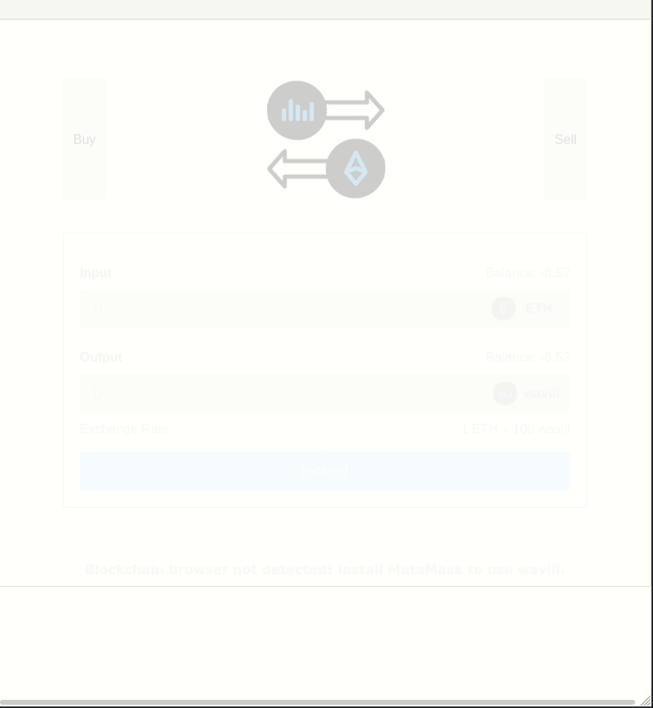
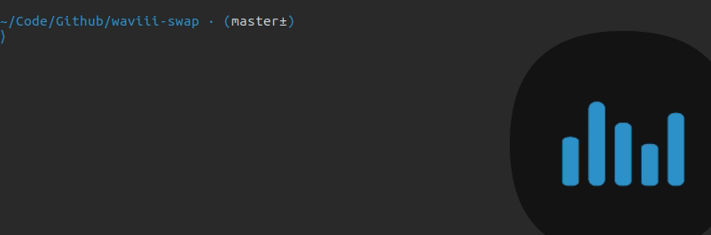

## waviii-swap

Web3 Ethereum Token Swap for the waviii Ethereum Token. Deployed to the InterPlanetary FileSystem (IPFS). This component is used within the official [waviii.io](https://github.com/MBrassey/waviii.io) dApp.

#### Issues

- [x] [Integrate with smartcontract, Initial setup](https://github.com/MBrassey/waviii-swap/issues/1)
- [x] [Locked View, React Animations & App Cleanup](https://github.com/MBrassey/waviii-swap/issues/2)
- [x] [Complete Documentation / Deploy 2 IPFS](https://github.com/MBrassey/waviii-swap/issues/3)

#### The waviii Token

waviii Token is the Mainnet ERC-20 Ethereum Token waviii-swap was designed for. The Max Supply of waviii is one million. The live Token Smartcontract can be viewed on [Etherscan](https://etherscan.io/token/0x9cc6754d16b98a32ec9137df6453ba84597b9965) and its Source Code on [GitHub](https://github.com/MBrassey/waviii-token).

> Token
> 

#### SmartContract

The [Swap](https://etherscan.io/address/0x38abf018ea2f8066813c376a197b6df0349d86c5) SmartContract was deployed on [Jun-19-2020 12:33:59 AM +UTC](https://etherscan.io/tx/0xb0f8900bf7b5874ca0c6c7f30c23897c7451c1978fdb86e493cd0fc0d5a59648), it controls the value of waviii through a hard link 1:100 with Mainnet Ether.

> Swap Source Code

    pragma solidity ^0.5.0;

    import "./waviii.sol";

    contract EthSwap {
        string public name = "wavSwap";
        Token public token;
        uint public rate = 100;

        event TokensPurchased(
            address account,
            address token,
            uint amount,
            uint rate
        );

        event TokensSold(
            address account,
            address token,
            uint amount,
            uint rate
        );

        constructor(Token _token) public {
            token = _token;
        }

        function buyTokens() public payable {
            // Calculate the number of tokens to buy
            uint tokenAmount = msg.value * rate;

            // Require that EthSwap has enough tokens
            require(token.balanceOf(address(this)) >= tokenAmount);

            // Transfer tokens to the user
            token.transfer(msg.sender, tokenAmount);

            // Emit an event
            emit TokensPurchased(msg.sender, address(token), tokenAmount, rate);
        }

        function sellTokens(uint _amount) public {
            // User can't sell more tokens than they have
            require(token.balanceOf(msg.sender) >= _amount);

            // Calculate the amount of Ether to redeem
            uint etherAmount = _amount / rate;

            // Require that EthSwap has enough Ether
            require(address(this).balance >= etherAmount);

            // Perform sale
            token.transferFrom(msg.sender, address(this), _amount);
            msg.sender.transfer(etherAmount);

            // Emit an event
            emit TokensSold(msg.sender, address(token), _amount, rate);
        }
    }

#### IPFS

The waviii-swap react component is [deployed](https://waviii-swap.on.fleek.co/) to IPFS. The images, text, styles and javascript are all hosted on the InterPlanetary FileSystem (IPFS) in a fully decentralized way. In connjunction with the Ethereum SmartContract backend, waviii-swap is a dApp (Decentralized Application). As there is no central point of failure or central point of management, the dApp is highly redundant as well as highly censorship resistant.

#### Requirements

    node
    npm

#### Installation

    npm i

#### Usage

    npm run start
    browse: localhost:3001/

<h6>
:cyclone: Click the image(s) below to view the live <a id="Screenshots" href="https://waviii-swap.on.fleek.co/">webapplication</a>
</h6>

> Preview
> 

> No MetaMask Installed
> 

> Setup
> 

> Test
> 

#### Questions

Contact me at [matt@brassey.io](mailto:matt@brassey.io) with any questions or comments.

#### License

`waviii-swap` is published under the **CC0_1.0_Universal** license.

> The Creative Commons CC0 Public Domain Dedication waives copyright interest in a work you've created and dedicates it to the world-wide public domain. Use CC0 to opt out of copyright entirely and ensure your work has the widest reach. As with the Unlicense and typical software licenses, CC0 disclaims warranties. CC0 is very similar to the Unlicense.
